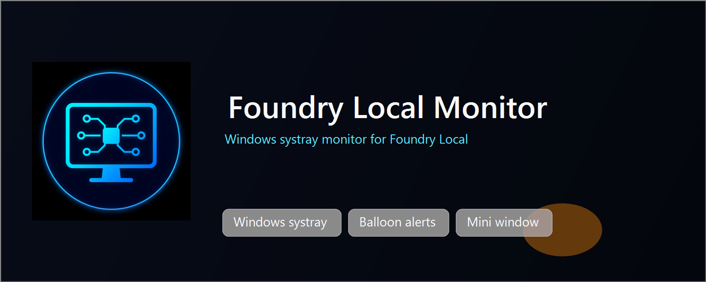

# ElBruno.FoundryLocalMonitor

[](https://www.nuget.org/packages/ElBruno.FoundryLocalMonitor)
[](https://www.nuget.org/packages/ElBruno.FoundryLocalMonitor)
[](https://github.com/elbruno/ElBruno.FoundryLocalMonitor/actions/workflows/build.yml)
[](LICENSE)
[](https://dotnet.microsoft.com/)
[](https://github.com/elbruno/ElBruno.FoundryLocalMonitor)



Windows systray monitor for [Foundry Local](https://learn.microsoft.com/en-us/azure/foundry-local/) — shows model load/unload notifications and a mini status window.

> ⚠️ **Windows only.** This tool uses WPF and the Windows Notification Area. It cannot run on macOS or Linux.

## Package

| Package | NuGet | Downloads | Description |
|---------|-------|-----------|-------------|
| `ElBruno.FoundryLocalMonitor` | [](https://www.nuget.org/packages/ElBruno.FoundryLocalMonitor) | [](https://www.nuget.org/packages/ElBruno.FoundryLocalMonitor) | Windows systray monitor for Foundry Local |

## Features

- 🔔 Balloon notifications when models load/unload
- 📊 Compact mini status window (always-on-top)
- 🖥️ Full dashboard: status, loaded models, available models
- ⚙️ Systray icon with context menu

## Install

```bash
dotnet tool install -g ElBruno.FoundryLocalMonitor
foundrylocalmon
```

## Requirements

- Windows 10/11
- .NET 10 runtime
- [Foundry Local](https://learn.microsoft.com/en-us/azure/foundry-local/how-to/how-to-install-foundry-local) installed

## Build from source

```bash
dotnet restore
dotnet build
dotnet test
```

## Publishing

GitHub Release or manual `workflow_dispatch` triggers publish. The workflow requires the `release` environment and the `NUGET_USER` secret, and uses OIDC Trusted Publishing (`NUGET_API_KEY` is not used).

## License

MIT

## 👋 About the Author

Made with ❤️ by [Bruno Capuano](https://github.com/elbruno).

## 🙏 Acknowledgments

- [Foundry Local](https://learn.microsoft.com/en-us/azure/foundry-local/) — runtime foundation
- [Hardcodet.NotifyIcon.Wpf](https://www.nuget.org/packages/Hardcodet.NotifyIcon.Wpf/) — tray icon support
