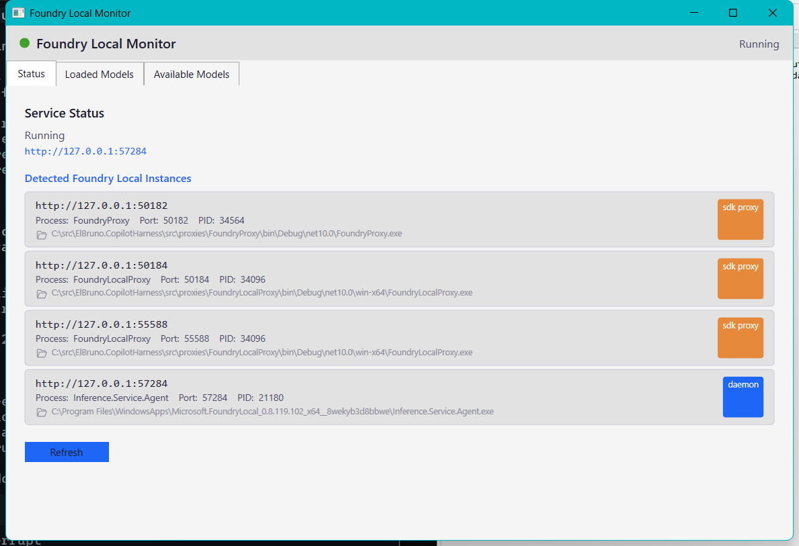
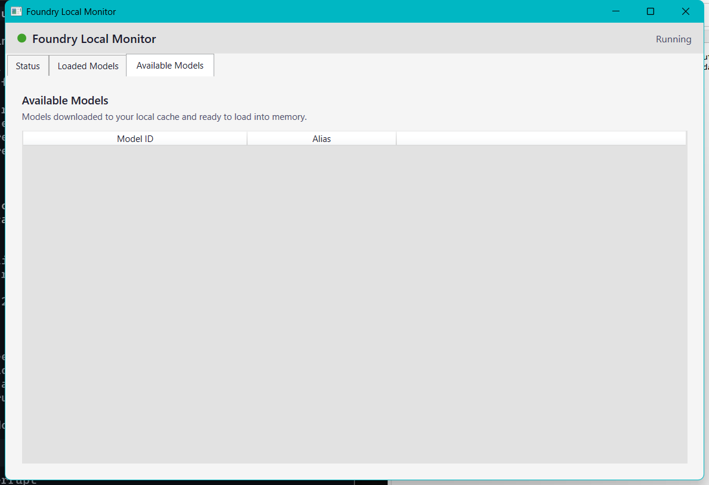

# ElBruno.FoundryLocalMonitor

[](https://www.nuget.org/packages/ElBruno.FoundryLocalMonitor)
[](https://www.nuget.org/packages/ElBruno.FoundryLocalMonitor)
[](https://github.com/elbruno/ElBruno.FoundryLocalMonitor/actions/workflows/build.yml)
[](LICENSE)
[](https://dotnet.microsoft.com/)
[](https://github.com/elbruno/ElBruno.FoundryLocalMonitor)


Windows systray monitor for [Foundry Local](https://learn.microsoft.com/en-us/azure/foundry-local/) — detects model load/unload events from **any app** using Foundry Local, regardless of language or SDK.

> ⚠️ **Windows only.** This tool uses WPF and the Windows Notification Area. It cannot run on macOS or Linux.

## Package

| Package | NuGet | Downloads | Description |
|---------|-------|-----------|-------------|
| `ElBruno.FoundryLocalMonitor` | [](https://www.nuget.org/packages/ElBruno.FoundryLocalMonitor) | [](https://www.nuget.org/packages/ElBruno.FoundryLocalMonitor) | Windows systray monitor for Foundry Local |

## Features

- 🔔 Toast notifications when models load/unload (Windows 10/11 Action Center)
- 📊 Compact mini status window (always-on-top)
- 🖥️ Full dashboard: **Status**, **Loaded Models**, and **Available Models** tabs
- 📁 Click any process path to open its folder in Explorer
- ⚙️ Systray icon with context menu
- 🔍 **Automatic multi-app discovery** — detects Foundry Local running in C#, Python, Node.js, Aspire, or any other context without manual configuration
- 🔕 **Smart notifications** — suppresses noisy SDK-internal events by default; only alerts for meaningful model changes

## UI Overview

### Status tab

Shows all discovered Foundry Local instances on the machine — each endpoint as a card with its URL, process name, port, PID, and process path. Click 📂 to open the process folder in Explorer.



### Loaded Models tab

Groups discovered instances by OS process (PID). Each card shows:
- Process name, PID, and type badge (**sdk proxy** or **daemon**)
- All ports this process listens on
- Process executable path with 📂 folder shortcut
- Every model currently loaded, with a **device badge** and the **source port**


**Device badge colours:**

| Badge | Colour | Meaning |
|-------|--------|---------|
| `CUDA` | 🟢 green | NVIDIA CUDA GPU |
| `TensorRT` | 🟩 emerald | TensorRT-optimised GPU |
| `DirectML` | 🟣 purple | DirectML GPU (Intel/AMD) |
| `WinML` | 🟠 orange | Windows ML CPU |
| `CPU` | 🔵 blue | Generic CPU |
| `GPU` | 🟢 green | Generic GPU |
| `?` | ⬜ gray | Device not detected (utility/proxy models) |

The right-hand column shows the source port (e.g. `:55588`) so you can tell which endpoint serves each model when a proxy listens on multiple ports.

### Available Models tab

Lists all models downloaded to your local Foundry cache and ready to load into memory.



## How Discovery Works

The monitor does **not** rely on the foundry CLI alone. It runs a parallel HTTP port scan across all active localhost listeners and identifies any endpoint serving the Foundry OpenAI-compatible API:

```
All 127.0.0.1 listeners  →  parallel GET /v1/models  →  group by PID  →  per-process cards
      (kernel call, ~1ms)       (800ms timeout each)      (merge ports)
```

This means the monitor detects:
- Models loaded via **`foundry model load`** (CLI / daemon path)
- Models loaded via the **C# `FoundryLocalManager` SDK** (port 55588 by default)
- Models loaded via the **Python `foundry-local-sdk`** (port 55589 by default)
- Models exposed through **.NET Aspire** proxy ports
- Any **other app** on any dynamic port that serves `/v1/models`

→ Full details: [docs/discovery.md](docs/discovery.md)

## Install

```bash
dotnet tool install -g ElBruno.FoundryLocalMonitor
foundrylocalmon
```

## Requirements

- Windows 10/11
- .NET 10 runtime
- [Foundry Local](https://learn.microsoft.com/en-us/azure/foundry-local/how-to/how-to-install-foundry-local) installed

## Samples

| Sample | Language | SDK path | Description |
|--------|----------|----------|-------------|
| [`samples/FoundryLocalChat`](samples/FoundryLocalChat/) | C# | SDK internal server (55588) | Automated E2E demo with SDK |
| [`samples/FoundryLocalChatPy`](samples/FoundryLocalChatPy/) | Python | SDK internal server (55589) | Same demo in Python |

Both samples run together in the **multi-client E2E test** to verify the monitor detects events from two simultaneous apps.

## E2E Testing

```powershell
# Single-client test (C# only)
cd tests/e2e
.\Run-E2ETest.ps1 -LaunchMonitor

# Multi-client test (C# + Python simultaneously)
.\Run-E2EMultiClient.ps1 -LaunchMonitor
```

See [tests/e2e/README.md](tests/e2e/README.md) for full test documentation.

## Build from source

```bash
dotnet restore
dotnet build
dotnet test
```

## Publishing

GitHub Release or manual `workflow_dispatch` triggers publish. The workflow requires the `release` environment and the `NUGET_USER` secret, and uses OIDC Trusted Publishing (`NUGET_API_KEY` is not used).

## License

MIT

## 👋 About the Author

Made with ❤️ by [Bruno Capuano](https://github.com/elbruno).

## 🙏 Acknowledgments

- [Foundry Local](https://learn.microsoft.com/en-us/azure/foundry-local/) — runtime foundation
- [Hardcodet.NotifyIcon.Wpf](https://www.nuget.org/packages/Hardcodet.NotifyIcon.Wpf/) — tray icon support
