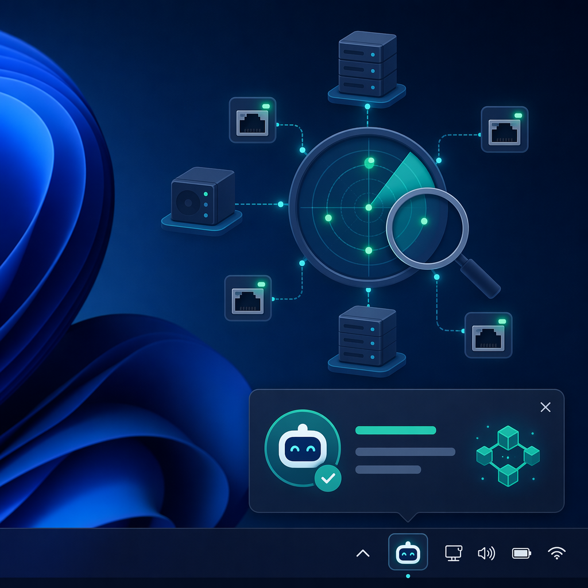
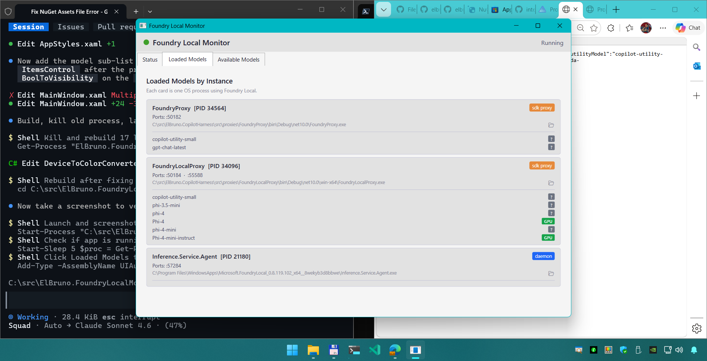

> ⚠️ _This blog post was created with the help of AI tools. Yes, I used a bit of magic from language models to organize my thoughts and automate the boring parts, but the geeky fun and the 🤖 in C# are 100% mine._

Hi!

If you have been playing with [Foundry Local](https://learn.microsoft.com/azure/ai-foundry/foundry-local/) to run AI models on your own machine, you probably ran into the same thing I did: **you never really know what is running.**

You load a model from the CLI. Your C# app loads another one through the SDK. A Python script spins up its own. A .NET Aspire sample launches a proxy. And five minutes later you have several models loaded across several ports, eating memory, and you have no idea which one belongs to what.

Foundry Local does not run on a single fixed port, and the `foundry` CLI only sees what the CLI itself started. Everything an app loads directly through the SDK is, basically, invisible.

So I built a small tool to fix that: **Foundry Local Monitor**.

It is a tiny Windows tray app that watches your machine and tells you, in real time, which Foundry Local instances are running, which models are loaded, and on which device (CPU, GPU, CUDA, DirectML…). When a model loads or unloads — from *any* app — you get a notification.

## What it does

- Lives in your system tray, out of the way.
- Discovers **all** Foundry Local instances on your machine, no matter which language or SDK started them.
- Shows the models loaded by each instance, grouped by process.
- Tells you the device backend for each model (CPU / GPU / CUDA / TensorRT / DirectML / WinML) with a colored badge.
- Fires a toast notification when a model is loaded or unloaded.
- Has a handy 📂 button to open the process location on disk.



## Install it

It is published as a .NET global tool, so one line and you are done:

```bash
dotnet tool install -g ElBruno.FoundryLocalMonitor
```

Then run it:

```bash
foundrylocalmon
```

That's it. Look for the 🤖 icon in your system tray. Right-click for options, double-click to open the main window with the Status, Loaded Models, and Available Models tabs.

To update later:

```bash
dotnet tool update -g ElBruno.FoundryLocalMonitor
```

## A quick example: the scenario it detects

Here is the kind of code the monitor is designed to see. This is a plain .NET console app using the [`Microsoft.AI.Foundry.Local`](https://www.nuget.org/packages/Microsoft.AI.Foundry.Local) SDK — no CLI involved. The SDK spins up its own OpenAI-compatible REST server, and *that* is exactly what the monitor finds and shows in real time.

```csharp
using Microsoft.AI.Foundry.Local;
using Microsoft.Extensions.Logging.Abstractions;

// The SDK hosts an internal OpenAI-compatible server on this address.
// The C# SDK default is 55588 (Python uses 55589).
var config = new Configuration
{
    AppName = "MyFoundryApp",
    Web     = new Configuration.WebService { Urls = "http://127.0.0.1:55588" }
};

await FoundryLocalManager.CreateAsync(config, NullLogger.Instance);
var manager = FoundryLocalManager.Instance;

// Start the web service — this is the endpoint the monitor discovers.
await manager.StartWebServiceAsync();
var endpoint = manager.Urls?.FirstOrDefault();
Console.WriteLine($"Foundry Local is serving at {endpoint}");
```

From this point on, the app is completely **invisible to the `foundry` CLI** — but the monitor sees it, because it answers on an HTTP port. The moment a model loads, you get a toast.

Talking to that endpoint is just OpenAI-compatible HTTP, so any .NET HttpClient works:

```csharp
using System.Net.Http.Json;

using var http = new HttpClient { BaseAddress = new Uri(endpoint!) };

var response = await http.PostAsJsonAsync("/v1/chat/completions", new
{
    model    = "qwen2.5-coder-0.5b",
    messages = new[]
    {
        new { role = "system", content = "You are a helpful assistant." },
        new { role = "user",   content = "What is Foundry Local in one sentence?" }
    },
    max_tokens = 200
});

var json = await response.Content.ReadAsStringAsync();
Console.WriteLine(json);
```

You can find a full end-to-end sample (init → start → load → chat → unload → stop) in the [`samples/FoundryLocalChat`](https://github.com/elbruno/ElBruno.FoundryLocalMonitor/tree/main/samples/FoundryLocalChat) folder of the repo.

## How instances are discovered

This is the part I like the most, so let me explain the trick.

Foundry Local does not use a well-known port. The daemon picks a random one at startup, the C# SDK defaults to `55588`, the Python SDK to `55589`, and an Aspire proxy gets whatever Aspire assigns. There is no central registry to ask.

So the monitor does something simple and effective: it **scans your local ports**.

1. It asks the OS for every TCP port currently listening on `127.0.0.1`. This is a fast kernel call, no guessing.
2. For each of those ports — **in parallel** — it sends a `GET /v1/models` request.
3. Any port that answers with `{"object":"list"}` is a Foundry Local (OpenAI-compatible) endpoint. Everything else is ignored.
4. Each discovered endpoint is enriched with process info: name, PID, full path, and whether it is an SDK proxy or the daemon.
5. Endpoints are grouped by PID, so one process = one card in the UI.

Why parallel? A typical machine has 15–30 listening ports. Probing them one by one, with a timeout each, could take 20+ seconds. Fanning out all the probes at once brings the whole scan down to roughly the time of a single probe — about 800ms. The scan re-runs every 30 seconds, so newly launched apps show up on their own.

In .NET, the port enumeration and the parallel probe boil down to something like this:

```csharp
using System.Net.NetworkInformation;

// 1. Ask the OS for every port listening on localhost (fast kernel call).
var listeners = IPGlobalProperties.GetIPGlobalProperties()
    .GetActiveTcpListeners()
    .Where(ep => IPAddress.IsLoopback(ep.Address))
    .Select(ep => ep.Port)
    .Distinct();

// 2. Probe them all in parallel — a Foundry endpoint answers /v1/models
//    with {"object":"list"}.
var probes = listeners.Select(async port =>
{
    using var http = new HttpClient { Timeout = TimeSpan.FromMilliseconds(800) };
    try
    {
        var json = await http.GetStringAsync($"http://127.0.0.1:{port}/v1/models");
        return json.Contains("\"object\":\"list\"") ? port : (int?)null;
    }
    catch { return null; }
});

var foundryPorts = (await Task.WhenAll(probes))
    .Where(p => p is not null)
    .Select(p => p!.Value);
```

The nice side effect: because the monitor talks HTTP and not the CLI, it sees **everything** — CLI, C# SDK, Python SDK, Aspire, or any OpenAI-compatible local server. If it listens and it answers, it shows up.

## How models are discovered

Once the monitor knows where the endpoints are, it asks each one what it is serving:

- For an **SDK proxy**, it calls `GET /v1/models`.
- For the **daemon**, it calls `GET /openai/loadedmodels` (the models actually in memory).

The interesting bit is the device. Foundry Local encodes the backend right in the model id as a suffix, for example:

```
Phi-4-mini-instruct-cuda-gpu:5
```

The monitor strips the version (`:5`), reads the suffix, and turns it into a friendly badge:

| Suffix | Device | Badge |
|---|---|---|
| `-cuda-gpu` | CUDA | 🟢 green |
| `-trtrtx-gpu` | TensorRT | 🟩 emerald |
| `-gpu` | GPU | 🟢 green |
| `-cpu` | CPU | 🔵 blue |
| `-directml-gpu` | DirectML | 🟣 purple |
| `-winml-cpu` | WinML | 🟠 orange |

The parsing itself is a nice little C# pattern-match — strip the version, match the longest device suffix, map it to a label:

```csharp
static (string Alias, string Device) ParseModelId(string modelId)
{
    // "Phi-4-mini-instruct-cuda-gpu:5" -> drop the ":5" version.
    var noVersion = modelId.Split(':')[0];

    // Longest suffixes first so "-cuda-gpu" wins over "-gpu".
    string[] suffixes =
    [
        "-trtrtx-gpu", "-cuda-gpu", "-generic-gpu", "-generic-cpu",
        "-winml-directml", "-winml-cpu", "-directml-gpu", "-cpu", "-gpu"
    ];

    foreach (var suffix in suffixes)
    {
        if (!noVersion.EndsWith(suffix, StringComparison.OrdinalIgnoreCase))
            continue;

        var alias  = noVersion[..^suffix.Length];
        var device = suffix switch
        {
            "-trtrtx-gpu"                       => "TensorRT",
            "-cuda-gpu"                         => "CUDA",
            "-generic-gpu" or "-gpu"            => "GPU",
            "-generic-cpu" or "-cpu"            => "CPU",
            "-winml-directml" or "-directml-gpu"=> "DirectML",
            "-winml-cpu"                        => "WinML",
            _                                   => "?"
        };
        return (alias, device);
    }

    return (noVersion, "?"); // utility models have no device suffix
}
```

So at a glance you can tell whether that model is actually running on your GPU or quietly sitting on the CPU. Very useful when you are wondering why something is slow.

And about those notifications: to avoid noise, models discovered on the SDK's own internal ports are marked *silent* by default. Only load/unload events from real apps or the daemon pop a toast. You can tune this in Settings.

## Wrap up

Foundry Local is a fantastic way to run models locally, and this little monitor gives you the missing piece of visibility: **what is actually running, right now, and where.** Install it, forget about it, and let it tell you when things change.

If you find a bug or want a feature, the repo is open — issues and PRs welcome.

Happy coding!

Greetings 🖐️

/El Bruno

## Resources

- 📦 NuGet package: [ElBruno.FoundryLocalMonitor](https://www.nuget.org/packages/ElBruno.FoundryLocalMonitor/)
- 🧩 Foundry Local .NET SDK: [Microsoft.AI.Foundry.Local](https://www.nuget.org/packages/Microsoft.AI.Foundry.Local)
- 💻 Source code on GitHub: [elbruno/ElBruno.FoundryLocalMonitor](https://github.com/elbruno/ElBruno.FoundryLocalMonitor)
- 📖 Foundry Local documentation: [learn.microsoft.com/azure/ai-foundry/foundry-local](https://learn.microsoft.com/azure/ai-foundry/foundry-local/)
- 🚀 Get started with Foundry Local: [Foundry Local quickstart](https://learn.microsoft.com/azure/ai-foundry/foundry-local/get-started)
